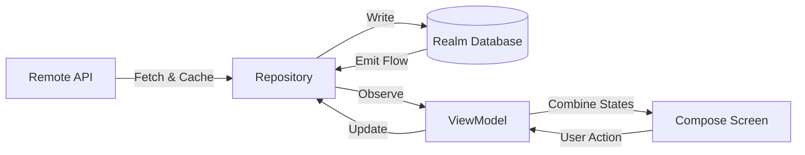

# 🛍️ Modern Android Product Explorer

> **A native Android application demonstrating the fusion of modern engineering practices with a reactive user experience.**

This project explores the [FakeStoreAPI](https://fakestoreapi.com/) ecosystem, implementing a robust **Offline-First** architecture where the UI is driven by a single source of truth (the database).

## ✨ Project Highlights

* **Reactive SSOT (Single Source of Truth):**
  The app leverages **Realm** as the absolute source of truth. The UI observes database changes via Kotlin `Flow`. When a user toggles a favorite, the write operation updates the DB, which immediately emits the new state to the UI. No manual UI refreshes required.

* **Modular Architecture:**
  Strict separation of concerns using multi-module architecture:
    * `:core` (Network, Database, Domain, UI, Data, Testing)
    * `:features` (ProductsList, Favorites, Profile)

* **Creative Engineering:**
  A focus on fluid data streams and state management, ensuring the application state remains consistent across different screens and lifecycle events.

## 🛠 Tech Stack & Libraries

Built with **Modern Android Development (MAD)** standards:

* **Language:** [Kotlin](https://kotlinlang.org/) (100%)
* **UI Toolkit:** [Jetpack Compose](https://developer.android.com/jetpack/compose) (Material3)
* **Architecture:** Clean Architecture + MVVM + Repository Pattern
* **Dependency Injection:** [Koin](https://insert-koin.io/)
* **Networking:** [Retrofit](https://square.github.io/retrofit/) + [Moshi](https://github.com/square/moshi)
* **Local Persistence:** [Realm Kotlin SDK](https://github.com/realm/realm-kotlin)
* **Concurrency:** Coroutines & Flows
* **Image Loading:** [Coil](https://coil-kt.github.io/coil/)
* **Build System:** Gradle Kotlin DSL + Version Catalog (`libs.versions.toml`)
* **Testing:** MockWebServer, MockK, Turbine, JUnit4

## 🏗️ Data Architecture (The Reactive Loop)

The application implements a unidirectional data flow strategy. The Repository merges network data into the local database, while the UI consumes streams directly from the database.

## ✅ Testing Strategy
**Quality** is ensured through a comprehensive testing pyramid:

**Unit Tests:** Business logic verification for UseCases and ViewModels using MockK and Turbine.

**Integration Tests:** Data layer verification using in-memory Realm instances.

**End-to-End (E2E) Tests:** Instrumented tests using MockWebServer to simulate real network scenarios and verify the full stack (Network -> DB -> UI) in an isolated environment.

## 🚀 Getting Started
**Clone the repository:**

* **Bash:**
git clone [https://github.com/yourusername/products-list-android.git](https://github.com/yourusername/products-list-android.git)

* **Open in Android Studio:**
Recommended version: Koala or newer.

* **Sync Gradle:**
Ensure you have JDK 17 configured.

* **Run:**
Launch the app on an Emulator or Physical Device.

## 👨‍💻 About the Author
**Andrea Tamburrino** - 
Creative Technologist & New Media Artist

I specialize in creating immersive interactive experiences using tools like TouchDesigner, Unreal Engine, and native Android development. This project represents my approach to Android mobile engineering: structured, scalable, and reactive.
